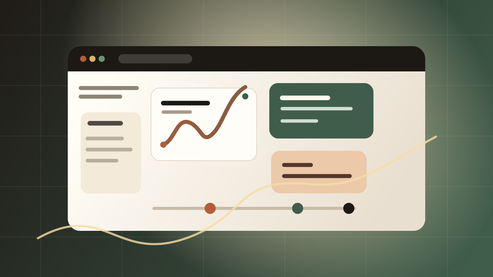
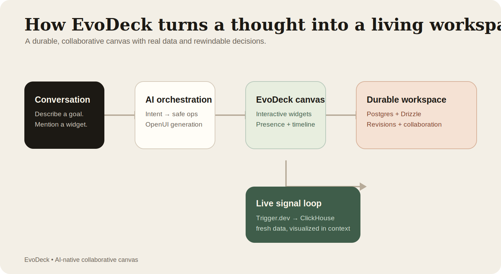
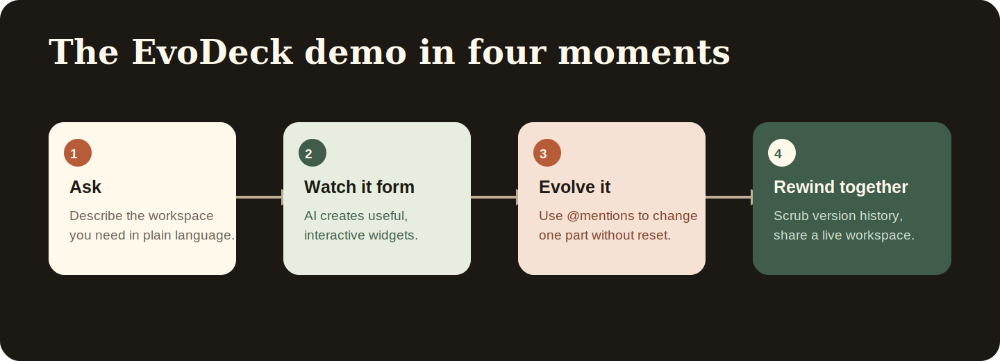

# EvoDeck

> **An AI-native collaborative canvas that turns conversation into an evolving, interactive decision workspace.**



## Description

EvoDeck turns plain-language requests into interactive visual workspaces for planning, research, and decision-making. Teams can generate charts, checklists, forms, flowcharts, decision matrices, and live-data desks; target individual widgets with `@mentions`; scrub a revision timeline; and branch alternate futures without overwriting the original decision trail.

The response is the workspace itself—not a chatbot beside a dashboard. EvoDeck combines generative UI, validated AI operations, PostgreSQL-backed history, real-time collaboration primitives, Trigger.dev workflows, and ClickHouse-backed live signals.

## Why it matters

- **Start with intent:** describe the workspace you need in natural language.
- **Make the answer interactive:** generated charts, controls, tables, and checklists are real UI.
- **Edit precisely:** every widget has a stable name, so `@mentions` can update one object without replacing the canvas.
- **Preserve decision memory:** meaningful changes become append-only revisions on a scrubbable timeline.
- **Explore safely:** fork a historical frame into a scenario branch while keeping the main path intact.
- **Use real signals:** source adapters can fetch live data and turn it into visual, source-backed desks.



## Demo in four moves



1. Create a workspace and ask: “Create a launch command center with a checklist, content calendar, risks, and a decision flow.”
2. Interact with the generated workspace—check an item, open a control, or rearrange a card.
3. Update one widget directly: `@content-plan add a launch-day social post and make the first item high priority`.
4. Scrub the timeline, choose **Explore scenario**, and compare a new direction without changing the original decision trail.

## Architecture

| Layer | What it does |
| --- | --- |
| **Next.js + React** | Delivers the collaborative canvas, chat experience, and workspace routes. |
| **OpenUI** | Provides typed, interactive building blocks for charts, tables, forms, checklists, and other generated UI. |
| **AI orchestration** | Converts user intent into validated operations such as adding or updating a widget. |
| **PostgreSQL + Drizzle** | Stores users, workspaces, messages, collaborators, revisions, and scenario branches. |
| **Trigger.dev** | Runs durable chat sessions with `chat.agent()`, source-sync and multi-step research workflows, including scheduled Hacker News sync. |
| **ClickHouse** | Stores and queries source events for live-data desks and analytical views. |

### Trigger.dev and ClickHouse flow

For a live-data request, EvoDeck detects the intent and calls a source adapter such as weather, Hacker News, RSS, GitHub, markets, or foreign exchange. The result is rendered immediately when possible and inserted into ClickHouse when credentials are configured. If an inline sync fails, EvoDeck queues `sync-source` or `research-workspace` on Trigger.dev; the worker performs the fetch and writes normalized events to ClickHouse.

ClickHouse is not used for transactional workspace state: PostgreSQL remains the system of record for users, messages, revisions, and branches. ClickHouse stores event-shaped live signals in the `events` table, keyed by workspace, source, event type, and timestamp. This separation keeps collaboration history durable while making live signals easy to query and aggregate.

## Built with

`Next.js 16` `React 19` `TypeScript` `OpenUI` `AI SDK` `Trigger.dev` `ClickHouse` `PostgreSQL` `Drizzle ORM` `Zustand`

## Run locally

### Prerequisites

- Node.js 20 or newer
- Docker Desktop (for PostgreSQL)
- An AI provider key, or a local OpenAI-compatible endpoint
- ClickHouse Cloud and Trigger.dev are optional for the basic canvas; they are needed for the full background-sync/live-event path

### Setup

```bash
cp .env.example .env.local
npm install

docker compose up -d
npm run db:migrate:sql
npm run db:seed
npm run dev
```

Open [http://localhost:3000](http://localhost:3000). The seed command creates a starter workspace; it is optional if you want to begin with a new workspace.

### AI provider configuration

Set `AI_PROVIDER` in `.env.local`, then restart the app:

| Provider | Required environment | Notes |
| --- | --- | --- |
| `openai` (default) | `OPENAI_API_KEY` | Also supports OpenRouter, LM Studio, and Ollama through `OPENAI_BASE_URL`. |
| `gemini` | `GEMINI_API_KEY` | Direct Google AI Studio option. |
| `vertex` | `GOOGLE_CLOUD_PROJECT` and credentials, or `VERTEX_API_KEY` | Set `GOOGLE_CLOUD_LOCATION` and optionally `VERTEX_MODEL`. |

To run the app with GPT-5.6, use:

```bash
AI_PROVIDER=openai
OPENAI_MODEL=gpt-5.6
```

The OpenAI adapter automatically omits a custom temperature for GPT-5.6 reasoning models and retries without it if an endpoint reports that temperature is unsupported.

### Optional ClickHouse setup

Create a ClickHouse Cloud service, copy its connection details from **Connect**, and set `CLICKHOUSE_URL`, `CLICKHOUSE_USER`, `CLICKHOUSE_PASSWORD`, and `CLICKHOUSE_DATABASE` in `.env.local`. Then initialize the database and event table:

```bash
npm run clickhouse:init
npm run clickhouse:events
```

Without ClickHouse credentials, ordinary workspaces still run. Live requests can use freshly fetched in-memory data, but events will not be persisted for later analytical queries.

### Optional Trigger.dev setup

Create a Trigger.dev project, set `TRIGGER_SECRET_KEY`, and start the local worker in a second terminal:

```bash
npm run trigger:dev
```

The worker loads tasks from `src/trigger`, including:

- `sync-source`: fetches one source and writes its events to ClickHouse.
- `research-workspace`: runs a multi-step Hacker News + RSS workflow with `triggerAndWait`.
- `sync-hackernews-schedule`: runs every 30 minutes when `DEFAULT_WORKSPACE_ID` is set.

If a live sync can run inline, the app uses that result immediately. Trigger.dev provides the durable asynchronous path for queued work, retries, logging, and scheduled execution.

EvoDeck also includes the `evodeck-chat-agent` Trigger chat task. It uses Trigger.dev’s durable session lifecycle and server-side access-token helpers so a conversation can resume across refreshes and worker restarts while continuing to use the configured EvoDeck AI provider.

## Useful scripts

| Command | Purpose |
| --- | --- |
| `npm run dev` | Start the Next.js development server. |
| `npm run build` | Create a production build. |
| `npm run lint` | Run ESLint. |
| `npm run trigger:dev` | Start the local Trigger.dev worker. |
| `npm run openui:generate` | Refresh the committed server-safe OpenUI prompt and schema. |
| `npm run clickhouse:init` | Verify ClickHouse connectivity and create the app database. |
| `npm run clickhouse:events` | Create the ClickHouse `events` table. |
| `npm run db:migrate:sql` | Apply the checked-in PostgreSQL migrations. |
| `npm run db:seed` | Create a demo workspace. |
| `npm run db:studio` | Open Drizzle Studio for the PostgreSQL database. |

## How Codex and GPT-5.6 were used

Codex was used as the coding agent throughout the build: it inspected the existing repository, implemented and refined the Next.js application, helped structure the OpenUI widget model, added validated workspace operations, built PostgreSQL persistence and timeline branching, connected live-data adapters, and verified the local development workflow.

GPT-5.6 serves two related roles:

1. **In the product:** when `OPENAI_MODEL=gpt-5.6`, it interprets workspace requests and produces structured, schema-checked operations that add or update visual widgets. The Trigger.dev `chat.agent()` path also uses the configured provider for durable, resumable conversations.
2. **During development:** it was used through Codex for architecture exploration, implementation, debugging, documentation, and iteration on the interaction model.

The product also keeps provider boundaries explicit: Gemini and Vertex are supported alternatives, while the OpenAI path is the one used for GPT-5.6.

## Project assets

- [EvoDeck mark](public/brand/evodeck-mark.svg)
- [EvoDeck wordmark](public/brand/evodeck-wordmark.svg)
- [Hero canvas artwork](public/brand/evodeck-hero.svg)
- [Architecture diagram](docs/architecture.svg)
- [Demo flow diagram](docs/demo-flow.svg)
